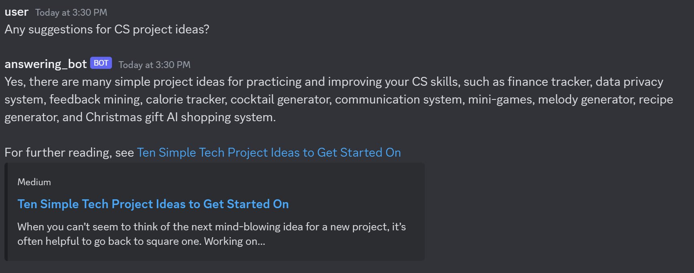
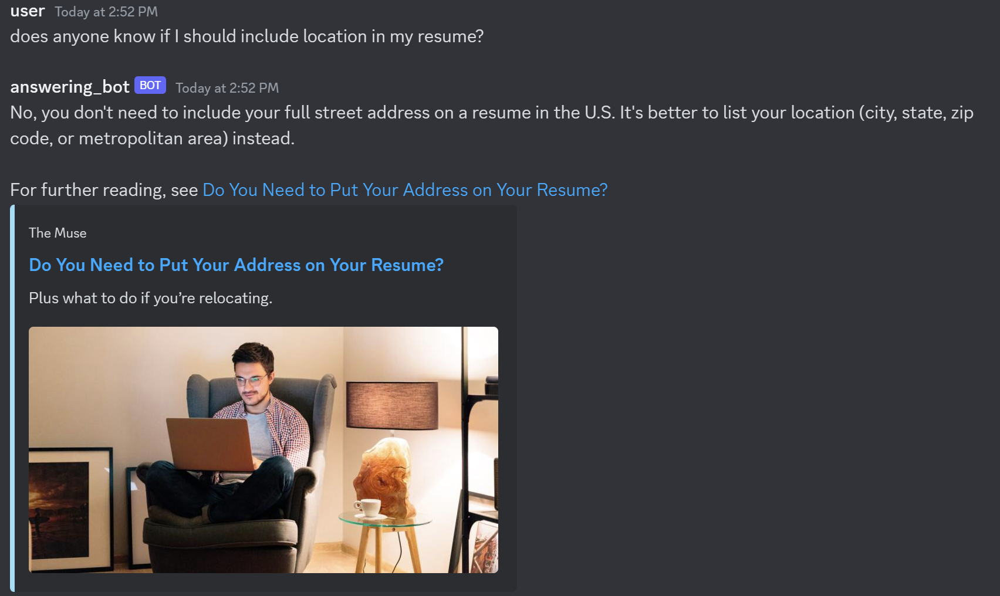
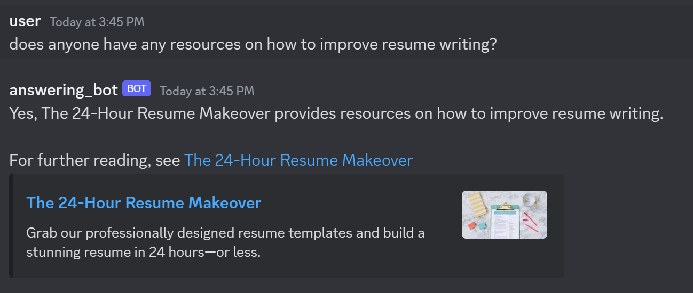

# Discord Bot Auto Answering Questions 

### Why use this?

Help your server members find answers to their questions effortlessly!

### Demo

### Overview

I use metaphor.systems API to answer questions automatically

There's 3 components:

1. Detect if a message is a question. Done using [mrsinghania/asr-question-detection ](https://huggingface.co/mrsinghania/asr-question-detection)

2. Get relevant queries. Done using Metaphor API

3. Find the best answer. Used replicate Mistral 7-B to find the best answer given context

### How to use

1. Get the following:
    - Discord Bot Token
    - Metaphor API Key
    - Replicate API Key

2. Run the following commands:
    - `pip install -r requirements.txt`
    - `python bot.py`